## 👨🏻‍💻 About me
Hi! I'm Pablo, a Software Development student from Málaga, Spain, currently studying Web Application Development (DAW) at IES Belén. I enjoy building applications, exploring new technologies, and turning
ideas into real projects. My main interests are software development, databases, mobile applications, and AI.

I previously studied Multiplatform Application Development (DAM) andAI & Big Data, where I worked with technologies such as Kotlin, Java, C#, Python, SQL, Flutter, Firebase, and Odoo. I'm currently focused on improving my development skills, building personal projects, and learning something new with every project I work on. 🚀

## 📬 Contact

- 📧 Email: paablomotaa2005@gmail.com
- 🌍 LinkedIn: [LinkedIn](https://www.linkedin.com/in/pablo-mota-malaga/)

